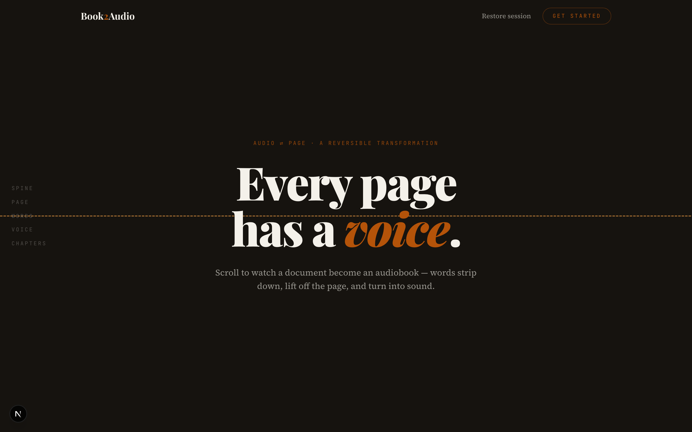
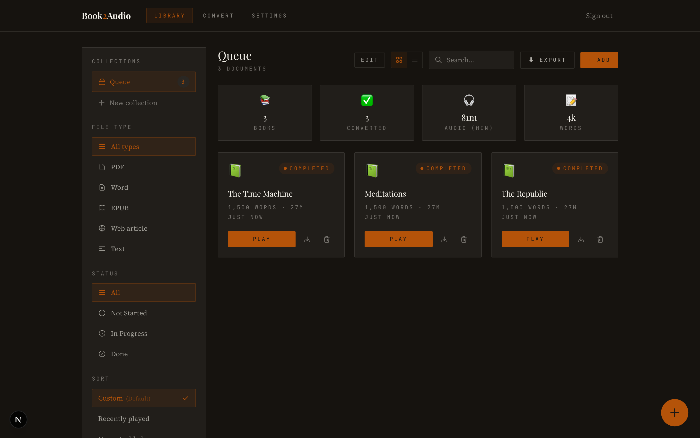
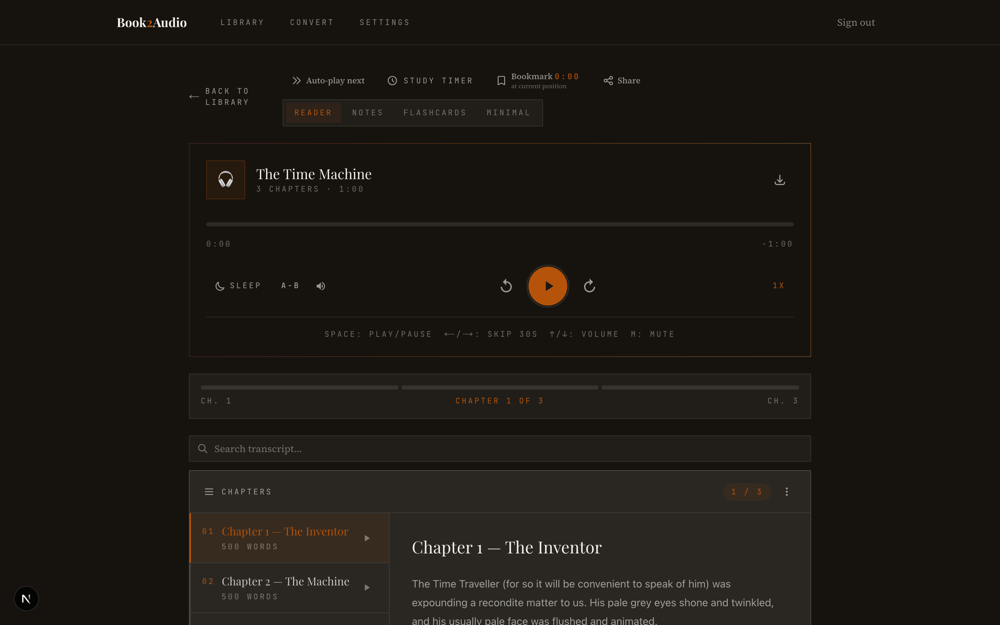
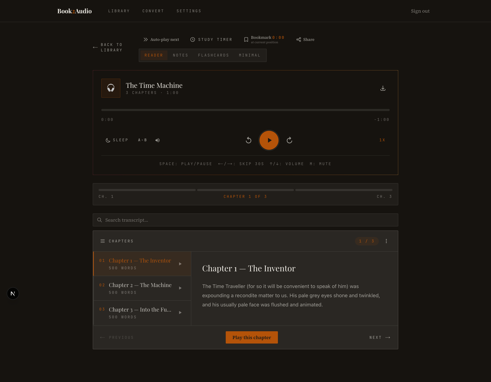

# 📖🎧 Book2Audio

<p>
  
  
  
  
  
  
  
</p>

**Turn documents into audiobooks.** Upload a PDF, EPUB, DOCX, TXT, a URL, or pasted text —
Book2Audio detects the chapters, strips the running headers/footers/page-number junk, and
reads it aloud in a natural neural voice. Listen in the app, download a `.zip` of MP3s, or
subscribe to your library as a **private podcast feed** and listen anywhere.

**No accounts.** The first time you convert something you get a **restore key**
(`PAGE-XXXX-XXXX-XXXX`) — that's your identity. Paste it on any device to get your library
back. Nothing to sign up for.

## Screenshots

<!-- Drop images into docs/screenshots/ (they'll render here once added). -->
<p align="center">
  
  
</p>
<p align="center">
  
  
</p>

> 📸 Add your own screenshots as `docs/screenshots/{home,library,player,reader}.png`.

---

## What it does

- **Many inputs** — PDF, EPUB, DOCX, TXT, a web URL, or pasted text.
  - Scanned/image PDFs fall back to **OCR**; JS/bot-protected pages fall back to a headless
    fetch, so more URLs "just work."
- **Chapter-aware** — detects chapters (PDF outline / EPUB spine / headings), so you can jump
  around and see a table of contents.
- **Natural voices** — 19 neural voices (US/UK/AU/CA/IE/IN accents) via edge-tts, with a free
  fallback so synthesis never hard-fails. (Optional paid OpenAI voices too.)
- **Big books, handled** — long documents auto-split into parts, each converted reliably; a
  per-session queue means your book converts without blocking anyone else.
- **Summaries** — full text, or an LLM-rewritten Long/Short summary (Gemini → OpenRouter),
  with an offline extractive fallback. Optional spoken 1-minute intro.
- **Full player** — reader view with synced scrolling + cross-chapter search, notes,
  flashcards, highlights, bookmarks, A-B loop, speed, sleep timer, study timer, and
  resume-where-you-left-off.
- **Take it with you** — installable **PWA**, an Expo **mobile app**, a whole-library `.zip`
  export, and a **private podcast RSS feed** (Overcast / Apple Podcasts / Pocket Casts).
- **Privacy-first & self-limiting** — anonymous sessions, per-session storage quota, and
  automatic cleanup of libraries left untouched for 30 days.

## How it works

```
Browser / PWA ──▶ Vercel (Next.js) ──/api/*──▶ Render (FastAPI)
                                          ┌────────┼───────────┐
                                          ▼        ▼           ▼
                                      Turso     Backblaze B2   edge-tts
                                    (metadata)   (audio)      (speech)
```

- **Frontend** — Next.js 15 (App Router), React 18, TypeScript, Tailwind — on **Vercel**.
- **Backend** — FastAPI (Python 3.11), pydub + ffmpeg, background conversion workers — on **Render**.
- **Mobile** — Expo / React Native, talking to the same API.
- **Storage** — metadata in **Turso** (hosted libSQL), audio in **Backblaze B2** (or Cloudflare
  R2) via the S3 API; local files + SQLite in dev. All storage-agnostic (env-driven).

## Quick start (local)

```bash
# Backend (Python 3.11) — needs ffmpeg installed
cd backend && pip install -r requirements.txt
TTS_PROVIDER=edge FORCE_EDGE_TTS=true uvicorn app.main:app --reload --port 8000

# Frontend (Node 20+)
cd frontend && npm install
BACKEND_URL=http://localhost:8000 npm run dev   # http://localhost:3000

# Or run the whole stack in Docker
docker-compose up --build
```

With no cloud env vars set, everything runs on local SQLite + local files — no accounts or
external services needed to try it.

## Deployment

- **Backend → Render** (Docker, `python:3.11-slim` + ffmpeg). `render.yaml` declares env vars.
  Health at `/api/health`.
- **Frontend → Vercel** (Next.js). `vercel.json` rewrites `/api/*` to the backend.
- **Persistence** — set Turso + B2 env vars so libraries survive redeploys (see
  [`DEPLOYMENT_PERSISTENCE.md`](./DEPLOYMENT_PERSISTENCE.md)).

## Configuration (highlights)

Everything is env-driven and optional-by-default. Common ones:

| Var | Where | Purpose |
|---|---|---|
| `TTS_PROVIDER` / `FORCE_EDGE_TTS` | backend | Use edge-tts neural voices |
| `TURSO_DATABASE_URL` / `TURSO_AUTH_TOKEN` | backend | Persistent metadata DB |
| `AUDIO_BUCKET` / `AUDIO_S3_*` | backend | Store audio in B2/R2 |
| `PUBLIC_API_URL` | backend | Absolute URLs for the podcast feed |
| `GEMINI_API_KEY` / `OPENROUTER_API_KEY` | backend | LLM-rewritten summaries (with fallback) |
| `OCR_SPACE_API_KEY` / `FIRECRAWL_API_KEY` | backend | Scanned-PDF OCR / hard-URL fetch |
| `SENTRY_DSN` | backend | Error monitoring |
| `ALLOWED_ORIGINS` / `JWT_SECRET` | backend | CORS / session signing |
| `NEXT_PUBLIC_UMAMI_ID` | frontend (Vercel) | Privacy-friendly analytics |

➡️ **Full reference + wiring steps for every service:** see the docs below.

## Documentation

- **[DOCUMENTATION.md](./DOCUMENTATION.md)** — architecture, every file explained, the
  complete env-var reference, per-service wiring, deployment, and API endpoints.
- **[DEPLOYMENT_PERSISTENCE.md](./DEPLOYMENT_PERSISTENCE.md)** — Turso + B2/R2 setup.
- **[CLAUDE.md](./CLAUDE.md)** — build/run + repo conventions.
- **[PRODUCTION_TODO.md](./PRODUCTION_TODO.md)** — roadmap & hardening notes.
